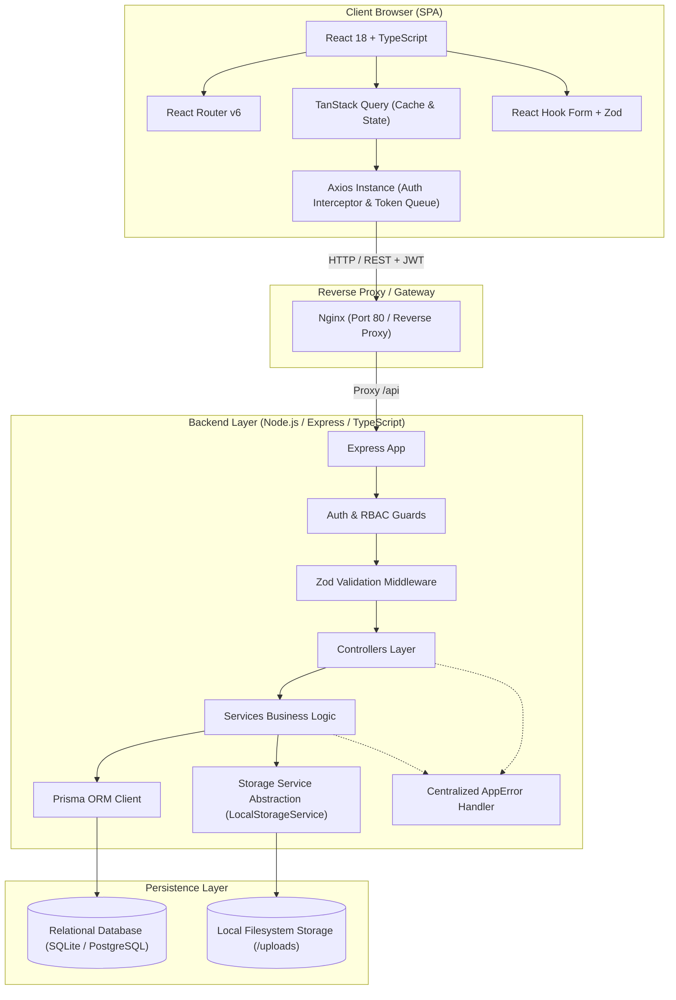
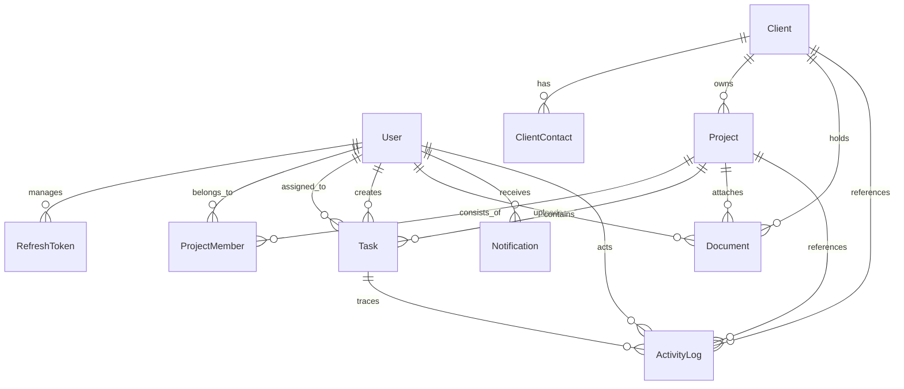

# CLIENTFLOW — System Architecture & Engineering Design

## 1. Overview
CLIENTFLOW is an enterprise client and project operations platform. It coordinates multi-client engagements, project lifecycle pipelines, task distribution workflows, document asset management, organization audit logging, and team velocity analytics.

---

## 2. High-Level System Architecture

---

## 3. Database Schema Design (Entity-Relationship)

### Relational Entities:
- **`User`**: Core identity model with unique email, bcrypt hash, role (`ADMIN`, `MANAGER`, `MEMBER`), and avatar url.
- **`RefreshToken`**: Session tracking table with token hashes, expiration timestamps, and revocation timestamps enabling single-device logout or full-session revocation.
- **`Client`**: Enterprise client account with status (`LEAD`, `ACTIVE`, `ON_HOLD`, `COMPLETED`, `ARCHIVED`), notes, company, and contact metadata.
- **`ClientContact`**: Specific stakeholders per client account, designated with primary flags, title, email, and phone.
- **`Project`**: Engagements linked to a client with status (`PLANNING`, `ACTIVE`, `ON_HOLD`, `COMPLETED`, `ARCHIVED`), priority (`LOW`, `MEDIUM`, `HIGH`, `URGENT`), target deadlines, and budgets.
- **`ProjectMember`**: Join relation establishing team members and assignment roles (`LEAD`, `CONTRIBUTOR`, `OBSERVER`) on specific projects.
- **`Task`**: Granular deliverables categorized across statuses (`TODO`, `IN_PROGRESS`, `BLOCKED`, `IN_REVIEW`, `DONE`), priority, assignee, creator, estimated hours, and completion dates.
- **`Document`**: File assets linked to projects/clients with storage key abstraction, MIME validation, and file size checks.
- **`Notification`**: Real-time user alert records with unread count tracking.
- **`ActivityLog`**: Immutable audit records capturing actor, action, entity type, ID, and serialized JSON metadata.

---

## 4. Security & Authentication Architecture

1. **JWT Dual-Token Rotation**:
   - Short-lived Access Token (15m validity): Passed in `Authorization: Bearer <token>` header containing `{ userId, email, role }`.
   - Long-lived Refresh Token (7d validity): Stored in database `RefreshToken` table and transmitted via secure HTTP-only cookies or body payload.
   - Axios request queue: Pending concurrent requests are buffered during refresh execution to prevent race conditions or duplicate refresh bursts.

2. **Role-Based Access Control (RBAC)**:
   - `ADMIN`: Unrestricted organizational permissions (User creation, status overrides, client archiving, root analytics).
   - `MANAGER`: Project creation, client management, team member assignments, task assignment, and document upload.
   - `MEMBER`: Task status execution, Kanban workflows, permitted project inspection, document uploads.

3. **Security Defenses**:
   - `Helmet`: HTTP security headers (XSS filtering, frameguard, CSP policies).
   - `CORS`: Origin whitelisting with credential support.
   - `Zod Validation`: Strict request payload sanitization preventing injection attacks.

---

## 5. Storage Abstraction Layer

- Interface `IStorageService` decouples storage implementation from business controllers.
- `LocalStorageService`: Writes to local file system disk (`./uploads`) with UUID-based filenames to prevent path traversal and collision attacks.
- Extensible interface designed to enable cloud object storage (e.g. S3 / MinIO) without changing route or controller contracts.

---

## 6. Testing & Quality Assurance Architecture

- **Test Framework**: Vitest test runner with Supertest for API integration testing.
- **Integration Coverage**:
  - Authentication flows (registration, duplicate validation, login, token refresh, logout revocation).
  - RBAC authorization matrix (verifying 403 Forbidden on unpermitted operations).
  - Business operations (Client, Project, Task Kanban lifecycle, Audit logging).
- **Frontend Verification**:
  - Component formatter and badge utility tests.
  - Strict TypeScript compiler (`tsc --noEmit`) checking across both client and server codebases.

---

## 7. Containerization & Deployment

- **Backend Container**: Multi-stage Docker build (`node:22-alpine`) compiling TypeScript to JavaScript and running production dependencies with Prisma Client.
- **Frontend Container**: Multi-stage Docker build compiling the Vite React application and serving production static assets via an Alpine Nginx reverse proxy.
- **Orchestration**: `docker-compose.yml` coordinates backend, frontend, and database services with isolated networking and persistent volume management.
